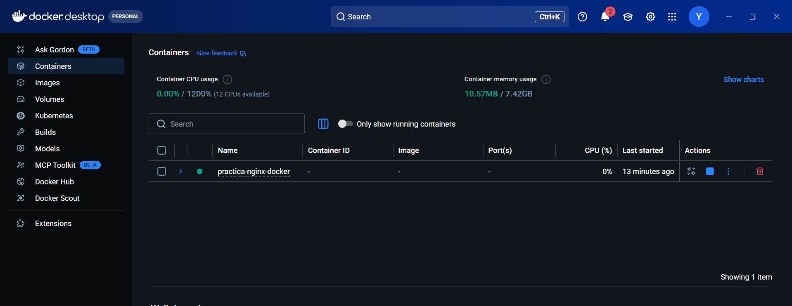
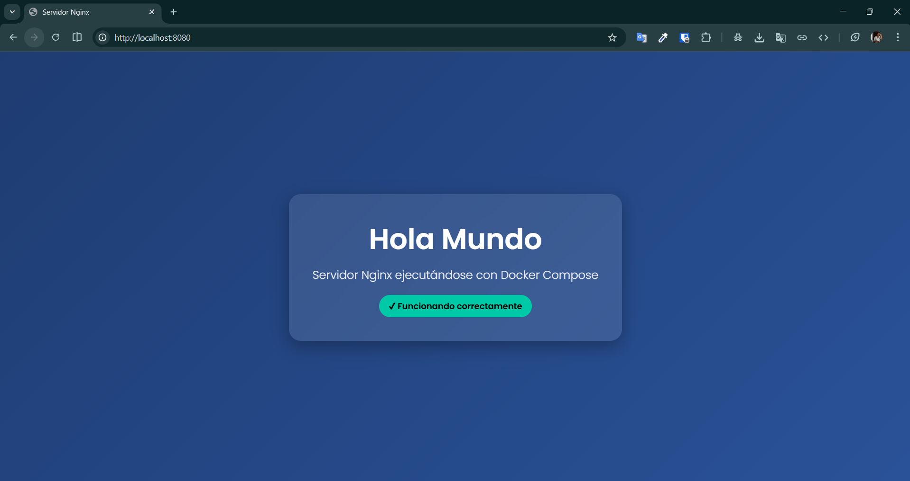

# Practica 6 - Servidor Web Nginx con Docker

## Descripción

En esta práctica se implementó un servidor web utilizando Nginx dentro de un contenedor Docker, gestionado con Docker Compose.

Se configuró un volumen para servir contenido HTML desde el equipo local y se expuso el puerto 8080 para acceder desde el navegador.

---

## Tecnologías utilizadas

- Docker
- Docker Compose
- Nginx
- HTML / CSS

---

## Estructura del proyecto

```
practica-nginx-docker/
│
├── docker-compose.yml
└── src/
    └── index.html
```

---

## Configuración

Archivo docker-compose.yml:

```yaml
version: '3.8'

services:
  nginx:
    image: nginx:latest
    container_name: mi_nginx
    ports:
      - "8080:80"
    volumes:
      - ./src:/usr/share/nginx/html
```

---

## Ejecución del proyecto

Para ejecutar el contenedor:

```
docker compose up -d
```

Luego abrir en el navegador:

```
http://localhost:8080
```

---

## Resultado





---

## Notas

- Se utilizó un volumen para permitir la actualización automática del contenido sin reiniciar el contenedor.
- El puerto 8080 fue mapeado al puerto 80 del contenedor.

---

## Autor

Yeliana Díaz
